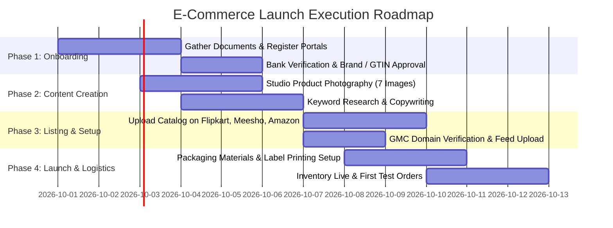

# Comprehensive E-Commerce Listing & Seller Onboarding Blueprint
**Platforms Covered:** Flipkart | Meesho | Amazon India | Google Shopping (Google Merchant Center)  
**Tailored for:** Kashish Ad (Signage, Promotional Displays, Printing & Custom Branding Products)

---

## Table of Contents
1. [Required Documents & Seller Account Setup](#1-required-documents--seller-account-setup)
   - [Core Universal Document Checklist](#core-universal-document-checklist)
   - [Platform-by-Platform Registration Steps](#platform-by-platform-registration-steps)
2. [Product Photography & Image Specifications Matrix](#2-product-photography--image-specifications-matrix)
   - [Master Image Comparison Table](#master-image-comparison-table)
   - [Standard 7-Image Catalog Architecture](#standard-7-image-catalog-architecture)
   - [Do's and Don'ts for Product Photos](#dos-and-donts-for-product-photos)
3. [Product Data Fields & Catalog Prerequisites](#3-product-data-fields--catalog-prerequisites)
   - [Core Mandatory Data Fields](#core-mandatory-data-fields)
   - [Logistics & Volumetric Weight Optimization](#logistics--volumetric-weight-optimization)
   - [GST & HSN Codes for Signage & Printing](#gst--hsn-codes-for-signage--printing)
4. [SEO Optimization, Titles & Copywriting Framework](#4-seo-optimization-titles--copywriting-framework)
   - [The High-Converting Title Formula](#the-high-converting-title-formula)
   - [The 5-Point Feature Bullet Framework](#the-5-point-feature-bullet-framework)
   - [Backend Search Terms & Keyword Rules](#backend-search-terms--keyword-rules)
   - [Ready-to-Use Listing Templates (Kashish Ad Products)](#ready-to-use-listing-templates-kashish-ad-products)
5. [Google Shopping & Google Merchant Center (GMC) Guide](#5-google-shopping--google-merchant-center-gmc-guide)
   - [Account Linking & Verification](#account-linking--verification)
   - [Product Feed Schema & Required Attributes](#product-feed-schema--required-attributes)
   - [Free Listings vs. Performance Max Ads](#free-listings-vs-performance-max-ads)
6. [Platform Fee Comparison & Fulfillment Models](#6-platform-fee-comparison--fulfillment-models)
7. [Step-by-Step 14-Day Launch Roadmap](#7-step-by-step-14-day-launch-roadmap)

---

## 1. Required Documents & Seller Account Setup

### Core Universal Document Checklist
Prepare scanned digital copies (PDF & clear JPEG/PNG, under 2 MB each) of the following documents before starting registration:

| Document | Purpose / Requirement | Important Notes |
| :--- | :--- | :--- |
| **GSTIN Certificate** | Mandatory for inter-state e-commerce (Flipkart, Amazon, Meesho). | Must match the legal entity or trade name. Regular GST is preferred. |
| **PAN Card** | Identity proof of Business or Proprietor. | For proprietorship: Personal PAN. For Pvt Ltd/LLP: Company PAN. |
| **Active Bank Account** | For weekly/bi-weekly seller payouts. | Cancelled cheque or bank statement showing Account Number, IFSC code, and Account Holder Name. |
| **Registered Business Address** | Pickup location for courier partners. | Complete postal address with accurate 6-digit Pincode where parcels will be picked up. |
| **Business Contact Details** | Dedicated business email address and active mobile number for OTP and seller notifications. | Use dedicated email (e.g., `sales@kashishad.com` or `kashishad.sales@gmail.com`). |
| **Trademark Certificate or Brand Authorization** | Brand Registry & protection against listing hijacking. | Trademark (TM status or Registered R status). If manufacturing unbranded items initially, apply for **GTIN Exemption** (no barcode needed). |
| **Digital Signature / Signature Image** | Required for seller invoices. | A clean black ink signature on plain white paper scanned as PNG/JPG. |

---

### Platform-by-Platform Registration Steps

#### A. Flipkart (Flipkart Seller Hub)
- **Portal:** [seller.flipkart.com](https://seller.flipkart.com)
- **Step 1:** Enter active mobile number, business email, and OTP verification.
- **Step 2:** Provide 15-digit GSTIN and verify business details fetched from the GST portal.
- **Step 3:** Enter exact **Pickup Address & Pincode**. Ensure courier serviceability check passes.
- **Step 4:** Provide bank account details and upload a cancelled cheque for penny-drop verification (Flipkart deposits ₹1 to verify).
- **Step 5:** Create your **Display Name** (Store name seen by buyers, e.g., `Kashish Advertising Solutions`).
- **Step 6:** Complete brand approval if selling under brand name "Kashish Ad", or select standard generic category.

#### B. Meesho (Meesho Supplier Panel)
- **Portal:** [supplier.meesho.com](https://supplier.meesho.com)
- **Step 1:** Register with mobile number and verify via OTP.
- **Step 2:** Enter GSTIN and confirm business legal name.
- **Step 3:** Enter Pickup Address for Meesho logistics partners (Delhivery, Shadowfax, Xpressbees).
- **Step 4:** Enter Bank Details (IFSC + Account Number) for payout cycles (7-day payout cycle).
- **Step 5:** Enter Store Name. Account is approved in usually less than 24 hours.
> **Key Meesho Benefit:** 0% commission model. Payout deductions are strictly shipping and return penalties (if applicable).

#### C. Amazon India (Amazon Seller Central)
- **Portal:** [sellercentral.amazon.in](https://sellercentral.amazon.in)
- **Step 1:** Create an Amazon account or sign in with existing Amazon credentials.
- **Step 2:** Choose Company Type (Proprietorship, Partnership, Pvt Ltd) and enter Business Name.
- **Step 3:** Provide GSTIN and verify PAN.
- **Step 4:** Select fulfillment preference:
  - **Easy Ship (Recommended to start):** You pack the order; Amazon courier picks it up from your warehouse in Patna.
  - **Self Ship:** You ship via your own tie-up courier (DTDC, Maruti, BlueDart).
  - **FBA (Fulfillment by Amazon):** You store stock at Amazon warehouse (requires Additional Place of Business in GST).
- **Step 5:** Bank verification via penny drop.
- **Step 6:** Complete 2-Step Verification (2FA) for security.
- **Step 7:** Apply for **Brand Approval** or **GTIN Exemption** for your product category (Signage, Office Products, Home Improvement).

#### D. Google Shopping (Google Merchant Center - GMC)
- **Portal:** [merchants.google.com](https://merchants.google.com)
- **Prerequisite:** An active, secure website with a checkout system, SSL (HTTPS), return/refund policy, and contact info.
- **Step 1:** Sign up with your primary Google account.
- **Step 2:** Enter business name, country (India), and currency (INR).
- **Step 3:** Verify and claim your website domain (via HTML tag, Google Analytics, or Google Tag Manager).
- **Step 4:** Configure shipping policies (free shipping threshold or flat rate) and return/refund policy.
- **Step 5:** Link Google Merchant Center with **Google Ads** account for running Shopping/Performance Max ads.
- **Step 6:** Upload your product data feed (via Google Sheets, XML feed, or automated e-commerce plugin like WooCommerce/Shopify/Content API).

---

## 2. Product Photography & Image Specifications Matrix

### Master Image Comparison Table

| Attribute | Flipkart | Meesho | Amazon India | Google Shopping |
| :--- | :--- | :--- | :--- | :--- |
| **Main Image Background** | Pure White (`#FFFFFF`, RGB `255, 255, 255`) | Plain White or light neutral background | Pure White (`#FFFFFF`, RGB `255, 255, 255`) strictly required | White or clean solid background |
| **Minimum Resolution** | 500 × 500 px | 800 × 800 px | 1000 × 1000 px | 1000 × 1000 px (250 × 250 for non-apparel min) |
| **Recommended Resolution** | **1500 × 1500 px** | **1200 × 1200 px** | **1600 × 1600 px** (Activates high-res zoom) | **1200 × 1200 px** |
| **Aspect Ratio** | 1:1 (Square) | 1:1 (Square) | 1:1 (Square) | 1:1 (Square) |
| **Product Frame Occupancy** | Minimum 80% to 85% of image area | Minimum 70% to 80% | Minimum 85% of frame | Minimum 75% to 85% |
| **File Formats** | JPEG / JPG | JPEG / JPG, PNG | JPEG / PNG (JPEG preferred for speed) | JPEG, WebP, PNG, GIF |
| **Max File Size** | 5 MB | 5 MB | 10 MB | 16 MB |
| **Watermarks / Text on Hero** | **STRICTLY PROHIBITED** | Not recommended | **STRICTLY PROHIBITED** (Auto-rejected) | **STRICTLY PROHIBITED** (Causes disapproval) |
| **Number of Images Allowed** | Up to 8 images | Up to 4–6 images | Up to 9 images (7 show on mobile) | 1 main + up to 10 additional |

---

### Standard 7-Image Catalog Architecture

For every product you list, produce these 7 visual assets to maximize conversion rates:

1. **Image 1: Hero / Main Image (Click Generator)**
   - Plain pure white background (`RGB 255, 255, 255`).
   - Clean, sharp shot of the exact product without packaging, props, or watermarks.
   - Fills 85% of the frame.
2. **Image 2: Dimensional & Scale Infographic**
   - Shows exact dimensions (Height, Width, Depth/Thickness in cm/inches).
   - Shows relative scale (e.g., placed next to a standard office desk, human hand, or doorway).
3. **Image 3: Material & Build Quality Close-Up (Macro Shot)**
   - Highlighting materials: Cast acrylic thickness, aluminum base quality, cold UV-LED ink finish, LED brightness, waterproof joints.
4. **Image 4: Lifestyle / Contextual In-Use Shot**
   - Shows the product in its real environment (e.g., Roll-up Standee placed at a corporate lobby or exhibition stall; Neon Sign glowing in a cafe or store).
5. **Image 5: Key Feature Callouts (Graphic Overlay)**
   - 3 to 4 graphical icons highlighting core benefits (e.g., "100% Weatherproof", "Tear-Resistant Vinyl", "Plug & Play Adapter Included", "High-Definition 1440 DPI Print").
6. **Image 6: Installation & Setup Guide**
   - 3-step visual instruction showing how easy it is to assemble or mount (e.g., wall mounting hardware, peel-and-stick adhesive, or pull-up mechanism).
7. **Image 7: "What's in the Box" / Complete Package Contents**
   - Every single component included in the package laid out neatly (e.g., Standee Frame + Printed Vinyl + Carry Bag + Instruction Sheet). Eliminates customer confusion and reduces returns.

---

### Do's and Don'ts for Product Photos

- ✅ **DO:** Use bright, diffused studio lighting to avoid harsh shadows.
- ✅ **DO:** Compress images to under 1.5 MB without losing sharpness using tools like Squoosh or TinyPNG.
- ✅ **DO:** Save master files in 1600 × 1600 px 72 DPI sRGB color profile.
- ❌ **DON'T:** Use artificial mockups that misrepresent the physical texture or real scale.
- ❌ **DON'T:** Add promotional badges on the main hero image (e.g., "FREE SHIPPING", "50% OFF", "TOP SELLER"). This leads to instant suspension on Google Shopping and listing suppressions on Amazon/Flipkart.
- ❌ **DON'T:** Upload blurry smartphone photos taken under warm yellow domestic bulbs.

---

## 3. Product Data Fields & Catalog Prerequisites

### Core Mandatory Data Fields

| Field Name | Description | Example (Roll-up Standee) |
| :--- | :--- | :--- |
| **Product Title** | Primary name indexed for search algorithms. | *See Title Formula below.* |
| **Brand Name** | Brand identity (registered or generic). | Kashish Ad |
| **Manufacturer** | Full business entity name. | Kashish Advertising Solutions, Fraser Road, Patna |
| **SKU Code** | Internal stock tracking identifier. | `KA-STND-6X3-LUX-01` |
| **Barcode / EAN / UPC** | 13-digit standard barcode or GTIN. | *Required unless GTIN Exemption applied.* |
| **Model Name / Number** | Unique identifier for the design/type. | KAD-STAND-ALU63 |
| **Country of Origin** | Mandatory by Indian Consumer Protection rules. | India |
| **HSN Code** | 8 or 4-digit tax classification code. | `49111010` (Trade Advertising Material) |
| **GST Percentage** | Applicable Goods & Services Tax rate. | 18% |
| **MRP (Maximum Retail Price)** | Maximum printed retail price. | ₹ 2,499.00 |
| **Selling Price (Offer Price)** | Actual price the customer will pay. | ₹ 1,499.00 |
| **Stock / Inventory Quantity** | Available units in warehouse. | 50 |
| **Package Weight (Gross)** | Total weight of item + packaging box (kg). | 2.85 kg |
| **Package Dimensions** | Outer dimensions of courier box (L × W × H in cm). | 95 cm × 12 cm × 12 cm |

---

### Logistics & Volumetric Weight Optimization

E-commerce couriers (Delhivery, ATS, Ecom Express, BlueDart) charge shipping based on **chargeable weight**, which is the higher of:
1. **Actual Dead Weight** (measured on scale in kg)
2. **Volumetric (Dimensional) Weight** calculated as:
   $$\text{Volumetric Weight (kg)} = \frac{\text{Length (cm)} \times \text{Width (cm)} \times \text{Height (cm)}}{5000}$$

> [!WARNING]
> **Avoid Heavy Shipping Surcharges:**  
> If an acrylic board weighs 1 kg but is packed in an oversized 60 cm × 60 cm × 15 cm box, its volumetric weight is:  
> $\frac{60 \times 60 \times 15}{5000} = 10.8\text{ kg}$!  
> You will be billed for **11 kg of shipping**, wiping out your profit margin. Always use custom-fit corrugated boxes and bubble wrap sleeves.

---

### GST & HSN Codes for Signage & Printing

| Product Category | Recommended HSN Code | Description | GST Rate |
| :--- | :--- | :--- | :--- |
| **Printed Advertising Material / Posters / Banners** | `4911 10 10` | Commercial catalogues, advertising material, printed posters | 18% |
| **Roll-up Standees / Display Stands (Metal/Aluminium)** | `9403 20 90` | Metal furniture / promotional display structures | 18% |
| **Illuminated Signs, LED Nameplates, Neon Signs** | `9405 60 90` | Illuminated signs, illuminated nameplates & similar articles | 18% |
| **Acrylic Sheets / Fabricated Sign Holders** | `3926 90 99` | Other articles of plastics / acrylic fabrication | 18% |
| **Self-Adhesive Vinyl Prints & Floor Stickers** | `3919 90 90` | Self-adhesive plates, sheets, film, foil of plastics | 18% |

---

## 4. SEO Optimization, Titles & Copywriting Framework

### The High-Converting Title Formula

Online marketplace search algorithms (Amazon A9/A10, Flipkart Search, Google Search) rank products by keyword relevance and placement order.

#### Standard Formula (Max 150–200 Characters):
$$\text{[Brand Name]} + \text{[Core Product Keyword]} + \text{[Material / Construction]} + \text{[Dimensions / Size]} + \text{[Key Feature]} + \text{[Usage / Occasion]} + \text{[Color / Pack Details]}$$

#### Comparison:
- ❌ **Poor Title:** `Rollup Standee for shop advertisement best quality` *(Zero technical attributes, low search volume, no brand, poor keyword density).*
- ✅ **Optimized Title:** `Kashish Ad Luxury Aluminium Roll-up Standee (6x3 Feet) with HD Star Vinyl Banner Print | Portable Retractable Display Stand for Exhibitions, Conferences & Retail Showrooms (Silver Base)`

---

### The 5-Point Feature Bullet Framework

Online shoppers read bullet points on their mobile screens before making buying decisions. Structure your 5 bullets as follows:

```markdown
• [PREMIUM MATERIAL & DURABILITY]: Manufactured with aerospace-grade heavy aluminium base and scratch-resistant anodized silver finish. Includes high-tensile internal spring mechanism engineered for 500+ smooth pull-ups without jamming.

• [ULTRA HD VIVID PRINT QUALITY]: Printed on 320 GSM tear-resistant Star Flex / Matte Vinyl utilizing 1440 DPI Japanese Eco-Solvent inks. Delivers fade-proof, non-reflective graphics with rich color saturation under bright exhibition lighting.

• [COMPACT, LIGHTWEIGHT & PORTABLE]: Sets up in under 60 seconds without any tools or technical skills. Weighs just 2.6 kg and folds neatly into the included padded 600D water-resistant canvas carry bag with shoulder strap for easy travel.

• [VERSATILE BUSINESS APPLICATIONS]: Ideal for trade expos, corporate reception lobbies, doctor clinics, coaching institutes, retail sales promotional pop-ups, wedding backdrops, and conference registration desks.

• [COMPLETE PACKAGE & RELIABLE SUPPORT]: Package includes 1 x Heavy-Duty Aluminium Standee Base, 1 x High-Resolution Pre-Fitted Graphic Print, 1 x 3-Stage Support Pole, and 1 x Durable Padded Carrying Bag. Backed by 100% quality verification by Kashish Ad, Patna.
```

---

### Backend Search Terms & Keyword Rules

Backend search terms are hidden search keywords entered in your seller portal (Amazon backend search terms, Flipkart search keywords):

1. **Amazon Character Limit:** Exactly **249 bytes** (approx 240-249 characters). If you exceed 250 bytes, the entire block is ignored.
2. **Flipkart Limit:** Separate comma-delimited keyword tags up to 255 characters.
3. **Crucial Formatting Rules:**
   - **Do not repeat** words already present in your Title or Brand Name.
   - **Do not use punctuation** (no commas, semicolons, hyphens, or quotes). Separate terms with a single space.
   - **Do not use competitor brand names** (e.g., do not write *3M*, *HP*, *Avery*).
   - **Include common misspellings & regional variations** (e.g., `standi banner flex hoarding sign board priting stand poster display`).

---

### Ready-to-Use Listing Templates (Kashish Ad Products)

#### Product 1: Custom Acrylic LED Nameplate for Homes & Offices
- **Title:** `Kashish Ad Waterproof Acrylic 3D LED Home Name Plate (12x8 Inch) | Warm White Backlit Laser Cut Customized House Number Board for Outdoor Wall Mounting`
- **Category:** Home & Kitchen > Home Décor > Nameplates & Signs
- **Search Terms:** `house number plate outdoor waterproof golden letters cottage door sign apartment flat villa name board light glow wall mounted`

#### Product 2: Retractable Roll-up Standee Display Banner
- **Title:** `Kashish Ad Aluminium Roll-up Standee (6ft x 3ft) with High-Definition Star Vinyl Print | Retractable Pull-up Promotional Banner Stand for Events & Retail Branding`
- **Category:** Office Products > Office Supplies > Presentation Boards > Display Stands
- **Search Terms:** `trade show expo rollup banner stand standi portable backdrop exhibition presentation signage board standee flex`

#### Product 3: Custom "Open / Closed" Neon LED Sign
- **Title:** `Kashish Ad Vibrant Glowing LED Neon "Open" Sign Board (16x8 Inch) | Ultra-Bright Energy Efficient Wall Hanging Display for Cafes, Salons, Stores & Restaurants (12V Adapter Included)`
- **Category:** Lighting > Commercial Lights > Lighted Signs
- **Search Terms:** `shop sign open board cafe restaurant boutique bar night club window hanging led decorative glow light retro`

---

## 5. Google Shopping & Google Merchant Center (GMC) Guide

Google Shopping allows your products to appear directly at the top of Google Search results when users search for items (e.g., "buy roll up standee online" or "acrylic nameplate manufacturer").

```
+-----------------------------------------------------------+
| Google Search: "buy roll up standee online"               |
|                                                           |
| [ Image ]    [ Image ]    [ Image ]    [ Image ]          |
| Kashish Ad   Vendor B     Vendor C     Vendor D           |
| ₹1,499.00    ₹1,799.00    ₹1,999.00    ₹1,650.00          |
| Free Del.    Ratings 4.8  Ratings 4.5  Kashish Ad         |
+-----------------------------------------------------------+
```

### Account Linking & Verification
1. **Domain Claiming:** Go to Google Merchant Center > Business Information > Website. Add `https://kashishad.in` (or your registered e-commerce domain). Copy the Google HTML verification tag and insert it into the `<head>` of your website, then click **Verify & Claim**.
2. **Link to Google Ads:** Settings > Linked Accounts > Google Ads. Send a link request to your Google Ads CID (Customer ID). This enables paid Shopping ads.
3. **Link to Google Business Profile:** Link your verified local Google Business Profile to unlock **Local Inventory Ads** (shows local shoppers in Patna that items are available in-store).

---

### Product Feed Schema & Required Attributes

Google Merchant Center requires strict data feed specifications. If formatting is incorrect, your entire feed can be disapproved.

| Google Attribute | Type | Description & Format Rule | Example |
| :--- | :--- | :--- | :--- |
| `id` | String (Max 50) | Unique permanent alphanumeric SKU identifier. | `KA-STND-6X3-01` |
| `title` | String (Max 150) | Clear product name. Do NOT add ALL CAPS or promotional phrases. | `Kashish Ad Aluminium Roll Up Standee 6x3 Feet` |
| `description` | String (Max 5000) | Plain text description matching your landing page. | `Heavy duty retractable aluminium roll up standee...` |
| `link` | URL | Deep link directly to the specific product checkout page. | `https://kashishad.com/product/rollup-standee` |
| `image_link` | URL | Full URL of the primary image (Must be HTTP/HTTPS, min 1000x1000). | `https://kashishad.com/images/standee-hero.jpg` |
| `availability` | Enum | Allowed values: `in_stock`, `out_of_stock`, `preorder`, `backorder`. | `in_stock` |
| `price` | String | Number + 3-letter ISO currency code. | `1499.00 INR` |
| `brand` | String | Your brand name. | `Kashish Ad` |
| `identifier_exists` | Boolean | Set to `false` if the item does not have an official GTIN/barcode. | `false` |
| `condition` | Enum | Allowed values: `new`, `refurbished`, `used`. | `new` |
| `shipping` | Group | Country, Service, and Price. | `IN:::0.00 INR` |
| `google_product_category` | Number/Text | Google taxonomy category ID. | `Business & Industrial > Signage` |

---

### Free Listings vs. Performance Max Ads

- **Google Free Product Listings:** Appears in the "Shopping" tab of Google Search at zero ad cost. Requires a compliant GMC feed, accurate shipping, and returns information.
- **Performance Max (PMax) Campaigns:** Paid advertising across Google Search, Shopping, YouTube, Gmail, and Google Display Network. Highly profitable for high-intent queries with target ROAS (Return On Ad Spend) of 300% to 500%.

---

## 6. Platform Fee Comparison & Fulfillment Models

| Comparison Metric | Flipkart | Meesho | Amazon India | Google Shopping |
| :--- | :--- | :--- | :--- | :--- |
| **Commission Fee** | 5% – 18% (Varies by sub-category) | **0% Commission** (Supplier pays zero platform cut) | 6% – 17% (Referral fee) | **0%** (Direct to your website) |
| **Closing Fee / Fixed Fee** | ₹5 – ₹30 per order slab | **₹0** | ₹5 – ₹61 per order slab | **₹0** (Payment gateway ~2% on site) |
| **Shipping Responsibility** | Flipkart Courier (Ekart) | Meesho 3PL (Delhivery, Shadowfax) | Amazon Easy Ship / FBA / Self Ship | Merchant's own courier (Bluedart, DTDC, etc.) |
| **Settlement / Payout Time** | 7–10 days after order delivery | **7 days** post delivery | 7–14 days post delivery | Instant (to your payment gateway e.g., Razorpay) |
| **Return Handling** | Customer Returns + RTO (Return to Origin) | High RTO risk on COD; free RTO shipping for sellers | Controlled returns; return fees apply on certain claims | Controlled entirely by your store policy |
| **Best Suited For** | High volume standardized office/home decor items | Budget-friendly fast-moving promotional items & signs | Premium custom signs, branding kits, corporate orders | Direct high-ticket B2B inquiries and web orders |

---

## 7. Step-by-Step 14-Day Launch Roadmap



### Detailed Daily Checklist

#### Days 1–3: Accounts & Documentation
- [ ] Prepare scanned copies of GSTIN, PAN, Cancelled Cheque, and Pickup Address proofs.
- [ ] Create accounts on **Flipkart Seller Hub**, **Meesho Supplier Panel**, and **Amazon Seller Central**.
- [ ] Submit bank details and monitor ₹1 penny-drop deposits to complete verification.
- [ ] Claim brand name `Kashish Ad` or apply for **GTIN Exemption** under categories: *Signs & Banners, Office Products, Home Decor*.

#### Days 4–6: Photography & Image Production
- [ ] Clean products thoroughly; shoot high-resolution photos on plain white background.
- [ ] Process images to 1600 × 1600 px sRGB JPG format.
- [ ] Design the 7 standard images for each top product (Hero, Dimensions, Material Close-Up, Lifestyle, Feature Infographic, Setup Guide, Package Contents).
- [ ] Verify that the Hero image has **zero text, zero logos, and 100% white background**.

#### Days 7–9: Catalog Preparation & Bulk Upload
- [ ] Prepare an Excel master sheet containing: SKU, Title, 5 Bullets, Description, HSN Code, MRP, Selling Price, Box Dimensions (L×W×H cm), and Box Weight (kg).
- [ ] Create listings using Single Product Upload or Bulk Excel Templates on Flipkart, Meesho, and Amazon.
- [ ] Check QC (Quality Check) status in the seller panels. Address any rejected image or data errors within 24 hours.

#### Days 10–11: Packaging & Logistics Readiness
- [ ] Procure standard corrugated shipping boxes (3-ply or 5-ply for acrylic/frames), bubble wrap (50 GSM), and heavy packing tape.
- [ ] Set up a thermal shipping label printer (or laser printer with 4-per-page A4 sticker sheets) for printing courier labels with barcodes.
- [ ] Test the dispatch workflow: Download manifest, pack test parcel, stick shipping label on the largest flat surface.

#### Days 12–14: Google Merchant Center & Go-Live
- [ ] Verify website domain ownership on Google Merchant Center.
- [ ] Create and upload the product XML/Sheets feed containing all active product URLs and prices.
- [ ] Verify approval of free product listings in Google Merchant Center diagnostics.
- [ ] Set inventory counts to live numbers in all seller dashboards. Start accepting orders!

---

*Document prepared for Kashish Ad operations. Keep this blueprint updated as platform policies and commission structures evolve.*
